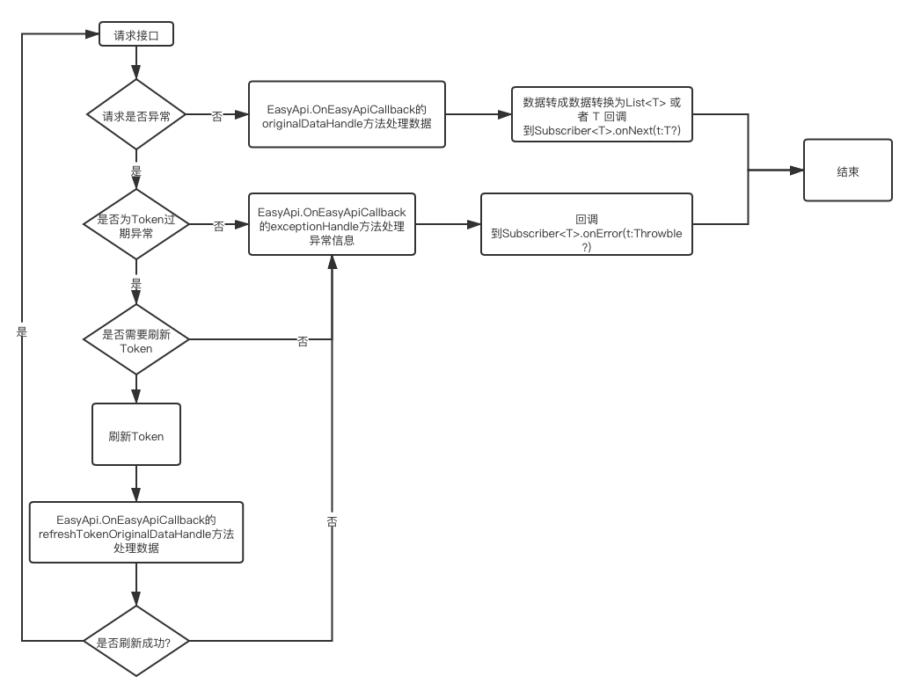
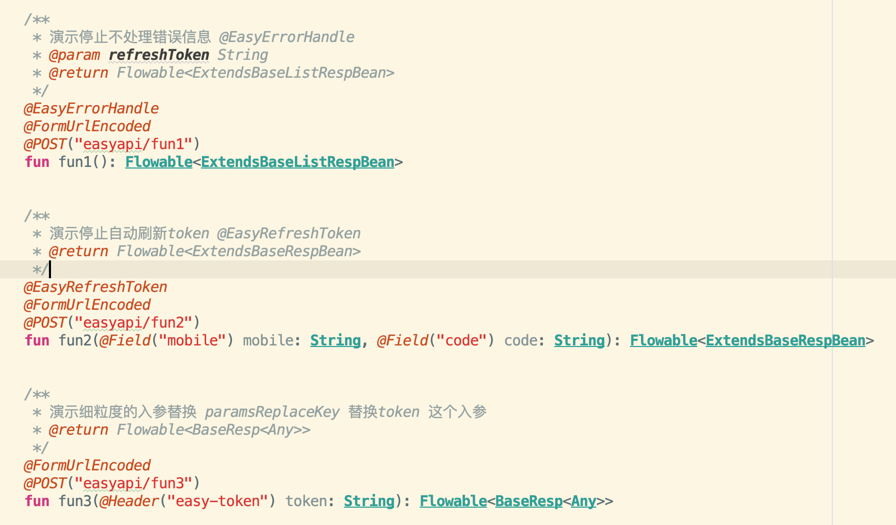
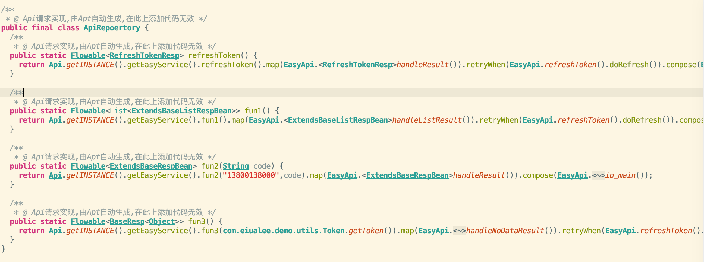
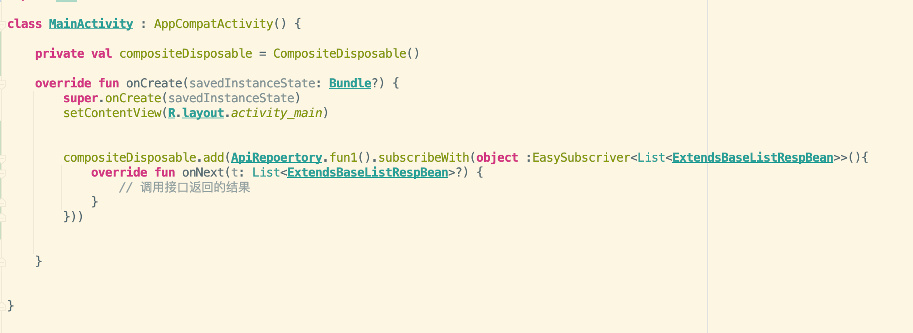

[](https://search.maven.org/search?q=g:%22io.github.eiualee%22%20AND%20a:%22easyapi%22)

#### 编写这个库的目的
让程序去帮你写接口调用实现类，减少重复性的代码，并在其中内置Token自动刷新，错误预处理两个核心功能，让你的请求更加简单快捷。
重要的是，拿到新接口，只需短短几步，即可直接调用。
直接上干货！

#### 自动化编译请求接口的逻辑



#### 使用效果

1、添加新接口



2、点击编译按钮


3、预览生成的文件



4、调用



#### 使用步骤（演示kotlin 版本）

##### 1、导入依赖包
```
api 'io.github.eiualee:easyapi:1.1.0'
kapt 'io.github.eiualee:easyapi_compiler:1.1.0'
```

##### 2、继承EasyApiServiceIface<T>,并添加单例
上面的泛型指的是Retrofit框架指定传入的接口，可参考   [ApiService.kt](https://github.com/EiuaLee/EasyApi/blob/master/app/src/main/java/com/eiualee/demo/api/ApiService.kt)  和 [Api.kt](https://github.com/EiuaLee/EasyApi/blob/master/app/src/main/java/com/eiualee/demo/api/Api.kt)

Retrofit框架指定传入的接口代码：

~~~kotlin
class Api: EasyApiServiceIface<ApiService> {

    private var apiService: ApiService
    private val logInterceptor = HttpLoggingInterceptor()
    private val okHttpClient: OkHttpClient
  
  	```
  	//手动添加的方法，必须为这个类的单例模式,如果是Java代码则方法名为getINSTANCE()
		companion object {
  		  @JvmStatic
  		  val INSTANCE: Api by lazy(lock = LazyThreadSafetyMode.SYNCHRONIZED) { Api() }
		}
  
    /**
     * 创建新的实例，一般用于多环境切换
     * @param baseUrl String
     * @return ApiService
     */
    private fun createApiService(baseUrl: String): ApiService {

        val retrofit = Retrofit.Builder()
            .client(okHttpClient)
            .addConverterFactory(
                GsonConverterFactory.create(
                    GsonBuilder().serializeNulls().create()
                )
            ) //此处不用Gson转换器改用String传转换器
            .addCallAdapterFactory(RxJava2CallAdapterFactory.create())
            .baseUrl(baseUrl)
            .build()

        return retrofit.create(ApiService::class.java)
    }

		```

    override fun getEasyService(): ApiService {
        return apiService
    }


}
~~~


注意，还需在实现EasyApiServiceIface<T>接口的类中添加一个叫做INSTANCE的方法，以 [Api.kt](https://github.com/EiuaLee/EasyApi/blob/master/app/src/main/java/com/eiualee/demo/api/Api.kt) 为例

```kotlin
companion object {
    @JvmStatic
    val INSTANCE: Api by lazy(lock = LazyThreadSafetyMode.SYNCHRONIZED) { Api() }
}
```

如果您的语言为JAVA，则添加方法名为getINSTANCE的方法，内部实现为单例模式

```java
//例子
public static Api getINSTANCE() {
 		//TODO 单例模式代码实现
    return api 
}
```

##### 3、创建您的BEAN基类，实现EasyRespIface<T>接口 ，主要是根据自己内部的数据结构自定义返回的数据  可参考 [BaseResp.kt](https://github.com/EiuaLee/EasyApi/blob/master/app/src/main/java/com/eiualee/demo/bean/BaseResp.kt)  [BaseListResp.kt](https://github.com/EiuaLee/EasyApi/blob/master/app/src/main/java/com/eiualee/demo/bean/BaseListResp.kt)

```json
//BaseResp.kt 和 BaseListResp.kt就是根据公司的json数据来定义的
 {"code":200,",msg":"成功","data":{"xxx":"xxx"....}}
//如果是列表
{"code":200,",msg":"成功","data":[{"xxx":"xxx"....}]}
```

##### 4、调用EasyApi.setOnEasyApiCallback 配置好全局参数,可参考  [Api.kt](https://github.com/EiuaLee/EasyApi/blob/master/app/src/main/java/com/eiualee/demo/api/Api.kt)

```kotlin
	 /**
     * 处理所需要的回调
     */
    interface OnEasyApiCallback {
        /**
         * 绑定刷新Token的请求接口，主要定义刷新token所需要用到的逻辑，比如刷新token后，将新的token保存					 * 到配置表中，供后续接口使用
         * @return EasyRefreshTokenIface<out EasyRespIface<*>>
         */
        fun bindRefreshToken(): EasyRefreshTokenIface<out EasyRespIface<*>>?

        /**
         * 处理原始数据，做一些逻辑处理，比如后端规定code==400为token超时，可以自定义一个token超时的		 					*	Exception,然后 bindRefreshToken（）方法内捕获这个Exception再重新请求token，Api.kt 文件中				 * 有例子，此处的用法很多，可以根据不用需求返回不同的Exception后做自己所需要的逻辑，此处异常会回调					* 到 exceptionHandle(e:Throwable):Exception 方法中，如果这个请求没问题或者不需要处理，返回 				  * null
         * @param t T
         * @return Exception
         */
        fun <T> originalDataHandle(t: T?): Exception?

        /**
         * 处理刷新token的原始数据，解释同上，因为怕在刷新token失败后，后端返回的code依旧等于400时会造成				 * 死循环，所以独立出来这个单独属于刷新token的数据处理，例如可以再自定义一个LoginException,抛出
         * 这个异常，后面会在 exceptionHandle(e:Throwable):Exception 方法做统一处理，如跳转登录页重
         * 新登录等
         * @param t T
         * @return Exception?
         */
        fun <T> refreshTokenOriginalDataHandle(t: T?): Exception?

        /**
         * 处理异常情况，主要实现自定义 Exception 和 请求过程中抛出的异常，如
         * HttpException,ConnecctException等，这里面可以做一些很有意思的逻辑处理，如		
         * 根据不同的异常提示不同的信息，或者根据自定义的异常做诸如重新登录等操作，可			
         * 参考Api.kt
         * @param e Throwable
         * @return Exception
         */
        fun exceptionHandle(e:Throwable):Exception
    }
```

##### 5、在Retrofit框架指定传入的接口中配置@ApiFactory 注解，共以下几个配置参数，结合生成的代码来一一解释

```kotlin
@ApiFactory(
    createApiFilePath = "com.eiualee.demo.api",
    createApiFileName = "ApiRepoertory",
    isEnableAutoRefreshToken = false,
    isEnableAutoHandleError = false,
    api = "com.eiualee.demo.api.Api",
    baseResp = "com.eiualee.demo.bean.BaseResp",
    baseListResp = "com.eiualee.demo.bean.BaseListResp",
    //细粒度的调整,请务必填入 完整包名带方法
    paramsReplaceKey = ["token","mobile"],
    paramsReplaceValue = ["com.eiualee.demo.utils.Token.getToken()","\"13800138000\""]
)
interface ApiService {
    ···
}
```

结合生成后的文件，来做一下说明
```kotlin
package com.eiualee.demo.api;
/**
 * @ Api请求实现,由Apt自动生成,在此上添加代码无效 */
public final class ApiRepoertory {
  /**
   * @ Api请求实现,由Apt自动生成,在此上添加代码无效 */
  public static Flowable<RefreshTokenResp> refreshToken() {
    return Api.getINSTANCE().getEasyService().refreshToken().map(EasyApi.				<RefreshTokenResp>handleResult()).retryWhen(EasyApi.refreshToken().doRefresh()).compose(EasyApi.<RefreshTokenResp>io_main());
  }
}
```

| 参数名            | 说明 |
| ----------------- | :--------------------------------------------------------: |
| createApiFilePath | 自动化编译后生成的文件的路径，也就是ApiService实现类的路径 |
| createApiFileName | 自动化编译后生成的文件的名称，默认为ApiRepoertory |
| isEnableAutoRefreshToken | 是否全局使用或禁用自动刷新Token |
| isEnableAutoHandleError | 是否全局使用或禁用自动刷新错误预处理 |
| api | 即实现EasyApiServiceIface<T>接口的类的包名+文件名 |
| baseResp | 实现EasyRespIface<T>接口，且需要返回的数据是一个实体 T 的类的包名+文件名 |
| baseListResp | 实现EasyRespIface<T>接口，且需要返回的数据是一个实体集合 List<T> 的类的包名+文件名 |
| paramsReplaceKey | 细粒度的调整，请参考下面解释 |
| paramsReplaceValue | 细粒度的调整所替换的值，请参考下面解释 |

###### 细粒度调整

在开发中，如果某些入参需要用全局参数，如UserId等，可以使用paramsReplaceKey来找到这个入参，然后将paramsReplaceValue中对应下标的内容填充进去，结合代码看一下

```kotlin
@ApiFactory(
    createApiFilePath = "com.eiualee.demo.api",
//    createApiFileName = "ApiMine",
//    isEnableAutoRefreshToken = false,
    isEnableAutoHandleError = false,
    api = "com.eiualee.demo.api.Api",
    baseResp = "com.eiualee.demo.bean.BaseResp",
    baseListResp = "com.eiualee.demo.bean.BaseListResp",
    //细粒度的调整,请务必填入 完整包名带方法
    paramsReplaceKey = ["token","mobile"],
    paramsReplaceValue = ["com.eiualee.demo.utils.Token.getToken()","\"13800138000\""]
)
interface ApiService {
    /**
     * 演示停止自动刷新token @EasyRefreshToken
     * @return Flowable<ExtendsBaseRespBean>
     */
    @EasyRefreshToken
    @FormUrlEncoded
    @POST("easyapi/fun2")
    fun fun2(@Field("mobile") mobile: String, @Field("code") code: String): Flowable<ExtendsBaseRespBean>


    /**
     * 演示细粒度的入参替换 paramsReplaceKey 替换token 这个入参
     * @return Flowable<BaseResp<Any>>
     */
    @FormUrlEncoded
    @POST("easyapi/fun3")
    fun fun3(@Header("easy-token") token: String): Flowable<BaseResp<Any>>

}
```

生成后的类

```kotlin
/**
 * @ Api请求实现,由Apt自动生成,在此上添加代码无效 */
public final class ApiRepoertory {
  /**
   * @ Api请求实现,由Apt自动生成,在此上添加代码无效 */
  public static Flowable<ExtendsBaseRespBean> fun2(String code) {
    return Api.getINSTANCE().getEasyService().fun2("13800138000",code).map(EasyApi.<ExtendsBaseRespBean>handleResult()).compose(EasyApi.<ExtendsBaseRespBean>io_main());
  }

  /**
   * @ Api请求实现,由Apt自动生成,在此上添加代码无效 */
  public static Flowable<BaseResp<Object>> fun3() {
    return Api.getINSTANCE().getEasyService().fun3(com.eiualee.demo.utils.Token.getToken()).map(EasyApi.<BaseResp<Object>>handleNoDataResult()).retryWhen(EasyApi.refreshToken().doRefresh()).compose(EasyApi.<BaseResp<Object>>io_main());
  }
}
```

对比方法中的入参，生成的代码中已经将全局参数配置进去了

##### 其他注解

(1)@EasyRefreshToken,该注解中有一个可配置的参数 ignore ，@EasyRefreshToken 的配置会覆盖@ApiFactory中isEnableAutoRefreshToken中的设置，即这个注解可单独控制某一项是否刷新Token。

(1)@EasyErrorHandle,该注解中有一个可配置的参数 ignore ，@EasyErrorHandle 的配置会覆盖@ApiFactory中isEnableAutoHandleError中的设置，即这个注解可单独控制某一项是否预处理错误信息。
